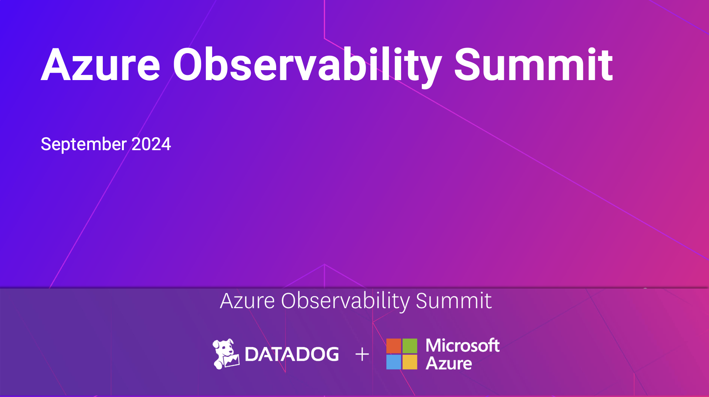

# Azure Observability Summit 2024
Companion material and resources for the "Azure Observability Summit" webinar on September 24th, 2024

[Watch on YouTube](https://www.youtube.com/watch?v=W8ShFoa7ALY)

## Resources

### Docs
- [Open Telemetry in Datadog](https://docs.datadoghq.com/opentelemetry/)
- [OTLP Ingestion by the Datadog Agent](https://docs.datadoghq.com/opentelemetry/interoperability/otlp_ingest_in_the_agent/?tab=host)
- [Set up LLM Observability](https://docs.datadoghq.com/llm_observability/setup/?tab=decorators)
- [LLM Observability API Reference](https://docs.datadoghq.com/llm_observability/setup/api/?tab=model)

### Blogs
- [Unify your OpenTelemetry and Datadog experience with the embedded OTel Collector in the Agent](https://www.datadoghq.com/blog/datadog-agent-with-otel-collector/)
- [Ingest OpenTelemetry logs with the Datadog Agent](https://www.datadoghq.com/blog/agent-otlp-log-ingestion/)
- [Monitor Azure OpenAI with Datadog](https://www.datadoghq.com/blog/monitor-azure-openai-with-datadog/)
- [Monitor your Anthropic applications with Datadog LLM Observability](https://www.datadoghq.com/blog/anthropic-integration-datadog-llm-observability/)
  
### Code
- [LLM Observability Jupyter Notebooks on GitHub](https://github.com/DataDog/llm-observability)
- [Blazor Demo code](https://aka.ms/blazorAIOTel)

### Product
- [LLM Observability](https://www.datadoghq.com/product/llm-observability/)
- [Open Telemetry](https://www.datadoghq.com/solutions/opentelemetry/)

### Upcoming Events
- [.NET Conf 2024](https://www.dotnetconf.net/)

### Other
- [Videos about Semantic Kernel](https://aka.ms/LetsLearnDotNet/Playlist)
- [.NET Learning Resources](aka.ms/letslearn/dotnet/aspire)
- [.NET Aspire Documentation](aka.ms/dotnet-aspire)
- [Semantic Kernel SDK Challenge](aka.ms/letslearn/dotnet/SK/csc)
- [.NET Aspire Videos](aka.ms/aspire/videos)
- [Engage with the team on GitHub](github.com/dotnet/aspire)
- [Let's Learn .NET Videos](aka.ms/letslearndotnet/playlist)

### Slides
- [Slides in PDF](slides/AzureSummitSeptember2024.pdf)
